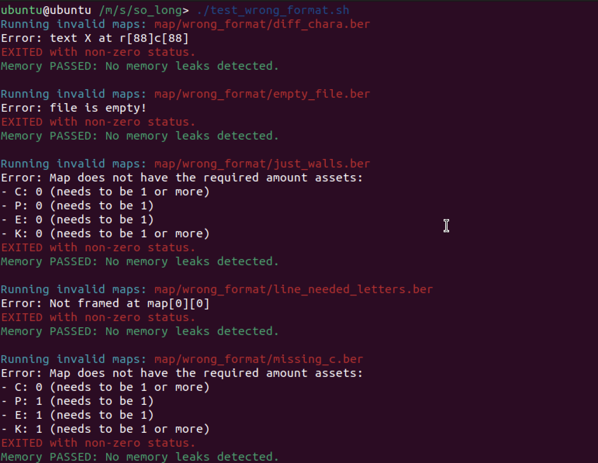
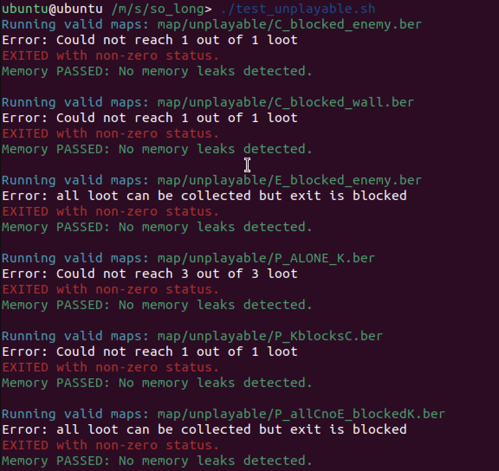
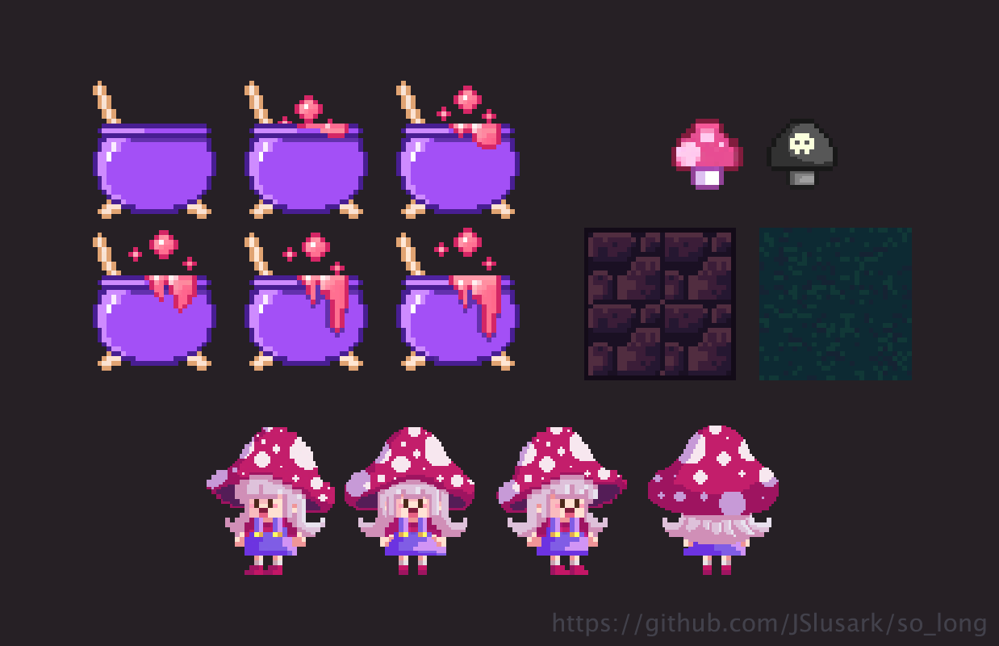

# About the project:
So_long is a simple 2D game made as an assignment of the 42 programming school core curriculum.
This project requires the creation of a 2d game where the player needs to collect all items on the map and avoid enemies to reach the exit and win the level.

In my project you play as a cute mushroom fairy who needs to collect colorful mushrooms and avoid touching the deadly ones, so that she can reach the cauldron that cooks magical mushroom soup and win the game! 😋🍄

# Tools used:
Instead of using modern game engines, we were required to use the MinilibX library, a simplified version of the X-Window (X11R6) programming API in C. The game's functionalities were built entirely from scratch with custom implementations that handle:

- **Tile-based rendering:** Parsing and displaying each symbol from the .ber files (01CPEK) as a 32x32 pixel tile.

- **Dynamic map validation:** In-game error detection for unplayable layouts, oversized maps, or missing assets.

- **Collision mechanics:** Implementing movement constraints for walls and other obstacles.

- **Player controls:** Keyboard-driven character movement and interaction:
	- Move the character using arrow keys or WASD.
	- Exit the game using Q, ESC, or by clicking the exit button.

- **Event-driven architecture:** Handling real-time graphical events, window updates, and user input.

- **Game state management:** Tracking win/lose conditions based on collected items and player actions.

- **Graphics rendering:** Loading textures, rendering sprites, and implementing frame-based animations.

- **HUD integration:** Displaying the move counter in-game and outputting results (win or lose) to the shell.

- **Cross-platform compatibility:** Supporting macOS and Linux environments with platform-specific handling.

- **Memory optimization:** Ensuring efficient memory usage to prevent leaks and optimize performance.

# How to compile and run the game

To compile the executable, in the terminal run:

`make`

The Makefile is configured to detect your operating system (Linux or macOS) and compile accordingly.
- **macOS:** Integrated with AppKit and OpenGL.
- **Linux:** Uses X Window System and X11.

To play a map, run the following command:

`./game maps/mapfile.ber`

Alternatively, you can run all maps using the created script:

`./play_all_levels.sh`

### Testing and debugging

*I also created scripts to test and handle different scenarios:*

1. **test_wrong_format.sh** runs all invalid maps from the maps/wrong_format directory. Maps are considered invalid if they are not rectangular, not framed by walls, contain invalid symbols and contain empty lines.
 	- Checks the exit codes.
 	- Validates leaks (only on Linux using Valgrind).
 	- Prints the specific type of error encountered.

2. **test_unplayable.sh** runs all unplayable maps from the maps/unplayable directory. Maps are considered unplayable when the map is bigger than the computer screen or when the player is not able to reach all collectibles and reach the cauldron to complete the game.
	- Checks the exit codes.
	- Validates leaks (only on Linux using Valgrind).
	- Prints the specific type of error encountered.

3. **test_playable.sh** runs all playable maps from the maps/unplayable directory.
	- Checks the exit codes.
	- Validates leaks (only on Linux using Valgrind).
	- If leaks are present, it prints details of the leaks.

#### About leaks
- **Linux:** Leak-free and verified with Valgrind (mandatory at 42 Berlin school to pass the project's requirements).
- **macOS:** Known minor leaks due to differences in memory handling within MinilibX for linux (optional requirement, to be fixed in a later moment).

# Graphics and resolution

All animation sprites and pixel art drawn digitally by me.
The pixel art was kept simple without focusing too much on precision.

  
  
  
  

The game art was initially inspired to this design from [Karina Dehtyar](https://www.behance.net/gallery/75507719/Witch-Artbook).
I really liked the cute, witchy character and before creating my sprites, I temporarily used hers as a reference while coding my project and testing its usability and gameplay.

**Resolution:**
The game's resolution was meant to be fixed. No support for scaling or expansion is needed.

**Level Design:**
The levels feature simple, custom layouts designed to keep the game enjoyable within the constraints of a 2D top-down game. Feel free to try them all—previews are provided below.

# Final notes

Feel free to explore the codebase, create more maps and play the game.
Also thank you for passing by and tested things out if you have 😊

For any questions and inquiries send a message to slusark.jessica@gmail.com

